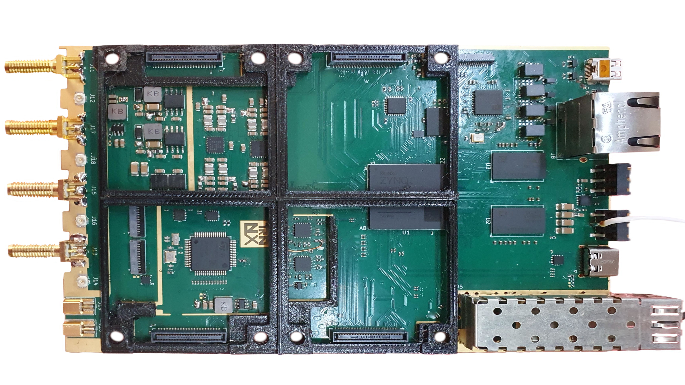
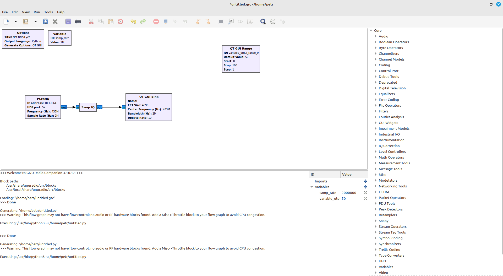
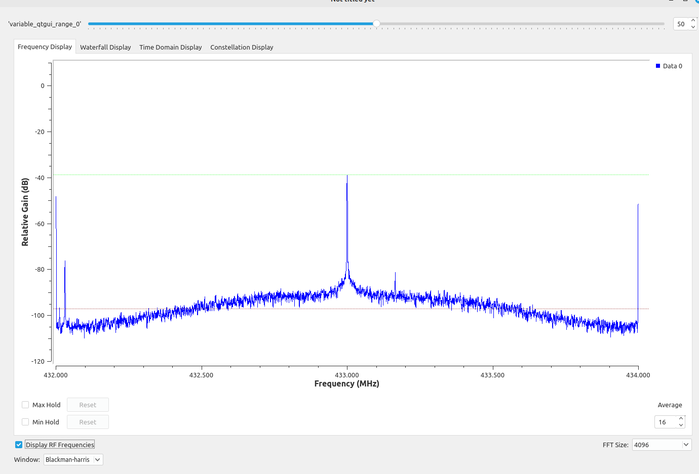
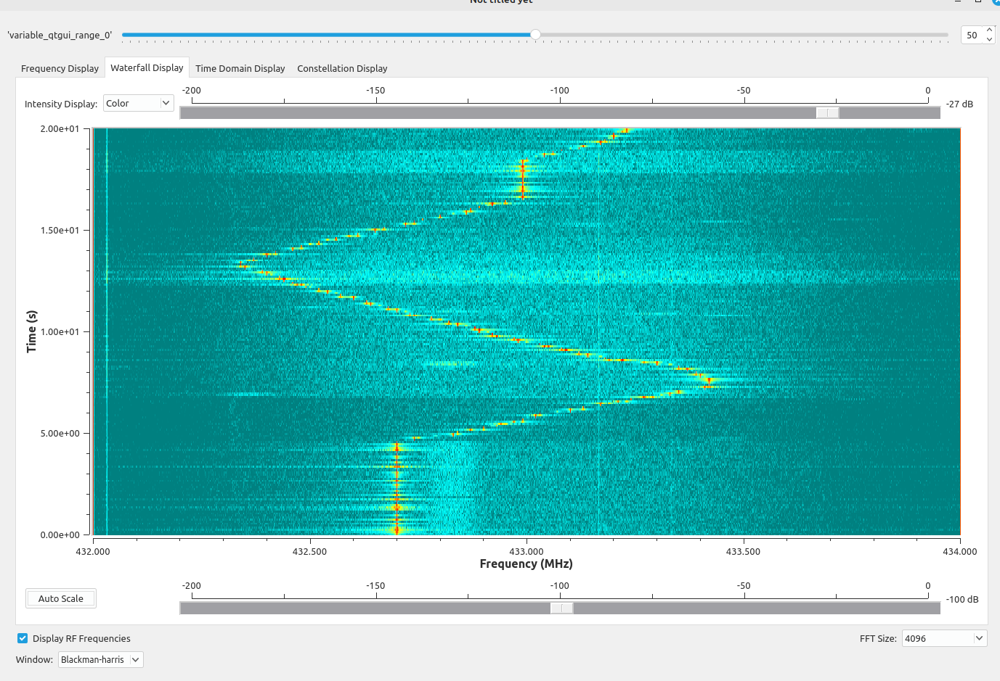
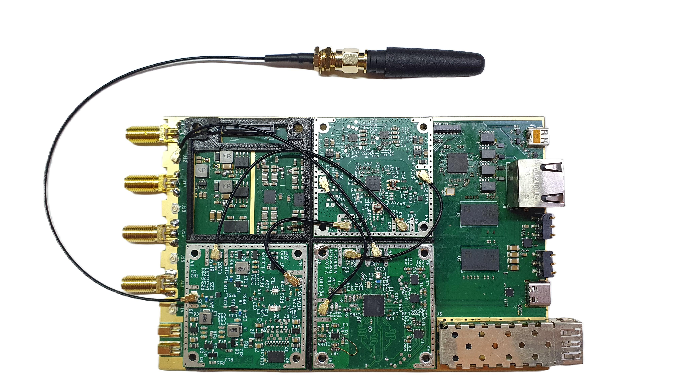

# #TRNXSDR - Open RF Research Platform

**A modular baseboard designed for advanced Software Defined Radio (SDR) ecosystems.**

---

## 📝 Project Overview
The **TRNXSDR** is a hardware platform engineered to host and interconnect specialized SDR modules. It acts as the central processing hub, providing high-speed logic, memory bandwidth, and versatile connectivity for complex radio applications.

> [!IMPORTANT]
> The **TRNXSDR** is a **Baseboard Platform**. While it provides the processing power and RF routing, it requires external SDR modules connected via the expansion slots for full radio functionality.

## #TRNXSDR Baseboard

  

---

## Key Technical Specifications

### ⚙️ Processing & Memory
*   **FPGA XC7Z015 Core**: High-speed logic for real-time Digital Signal Processing (DSP).
*   **1 GB DDR3 RAM @ 1066 MHz**: High-capacity memory for data buffering and complex waveform processing.
*   **80-pin Module Connectors**: High-density connectors ensuring reliable signal integrity between the baseboard and modules.

### 🌐 Connectivity & I/O
*   **1 Gbit Ethernet (Copper)**: Standard high-speed network integration.
*   **Optical Ethernet (SFP)**: Hardware ready for fiber-optic connection. Planned support for **1 Gbit / 2.5 Gbit+** throughput via GTX connection (up to **5 Gbit** for custom digital IF).
*   **USB-C**: Hardware support for **Power Delivery (PD)** to power the entire board via a single cable (9–20 V input). Firmware currently under development.
*   **4 SMA RF Connectors**: On-board SMA connectors for direct and stable antenna connections.

---

## 🛠 Modular Ecosystem & Scalability
The platform is designed to grow. The baseboard features a flexible slot system to accommodate various SDR modules.

| Slot Type | Quantity | Technical Capabilities |
| :--- | :---: | :--- |
| **Primary HS Slots** | **2** | **High-Speed Support**: 1x with 2L GTX (JESD204B support), both slots support LVDS. |
| **Primary LS Slots** | **2** | **Standard I/O**: Optimized for general-purpose SDR control and low-speed buses. |
| **Expansion Board** | **+6** | **Low-Speed Expansion**: Optimized for SPI, I2C, and LVDS control buses. |

---

## 💻 Software & Integration

### GNU Radio Support (Active Development)
**Core functionality is already verified!** We have developed a custom **OOT (Out-Of-Tree) Module**, enabling basic RX streaming between the hardware and GNU Radio.
*   *Current focus*: Stability improvements, feature expansion, and bug fixes.

Below, you can see a GNU Radio Companion (GRC) flowgraph demonstrating the implementation of the dedicated #TRNXSDR source block.

  

### Signal Analysis & Verification
To verify the RF chain's integrity, we tested the SDR in the 433 MHz band. The following image shows the captured spectrum in GRC, displaying a clean signal peak and minimal noise floor.

  

Furthermore, we performed a dynamic frequency shift test. In the waterfall plot below, you can see a "snake" pattern created by manually sweeping the carrier frequency. The sweep was performed roughly within a ±500 kHz range around the 433 MHz center.

  

### Future Software Roadmap (Planned)
*   **SoapySDR Compatibility**: Integration of a SoapySDR driver to provide a vendor-neutral API for tools like **SDR++, SDRangel, GNU Radio and more**.
*   **OpenWiFi Project**: Investigating the possibility of hosting the OpenWiFi stack (IEEE 802.11 FPGA/Software) on #TRNXSDR hardware.

---

## #TRNXSDR with AT86RF215 SDR Module and RFFC5072 Mixer Module + RF Front-End (LNA, PA...) Module

  

---

## 🟢 Future Hardware Roadmap
Expanding the #TRNXSDR ecosystem with high-end RF modules:
*   **Expansion Board**: A dedicated add-on board adding **6 additional low-speed slots** (Total of 10 modules).
*   **New SDR Modules**:
    *   **Lime Ecosystem**: Modules based on **LMS6002D** and **LMS7002M** (MIMO, wide frequency range).
    *   **Analog Devices Series**: High-performance transceivers based on **AD9361 / AD9363 / AD9364**.

---

## 🛠 Development Status

- [x] **Baseboard Hardware Design**: Completed (Rev 1.0) — *Functional, with known bugs being addressed.*
- [/] **Hardware Revision 2.0**: In progress (bug fixes and optimizations).
- [/] **GNU Radio OOT Module**: Functional — *Ongoing development and feature updates.*
- [/] **Optical Port**: Hardware ready, firmware development in progress.
- [/] **USB-C Power Delivery**: Hardware support implemented, firmware under active development.
- [ ] **SoapySDR & OpenWiFi**: Conceptual/Planned stage.
